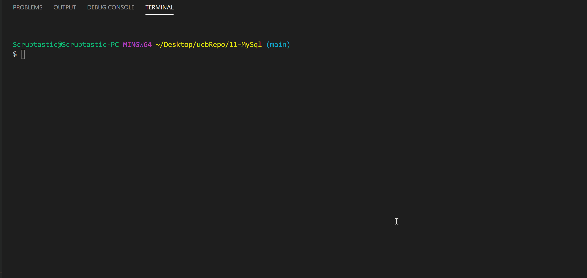

# 11-MySql

This program passes through a local server using Express and node.js. This program will allow you to create, save, and load past notes.

* Use of JavaScript.
* Use of Node.Js.
* Use of MySQL.
* NPM - Inquirer and MySql

## Usage

This application was created through MySql with JavaScript and Node.js. First open MySQL Workbench and run the query for data.sql. Open your integrated terminal in Visual Studio Code and then use the command node server.js. From here, you will have the option to select



## Code

Basic View Function:

```
function viewEmployeeAll() {
    console.log("View Employees")
    connection.query("SELECT * FROM employee", function (err, res) {
        if (err) throw err;
        console.table(res)
    })
    start();
}
```

Delete Function Code Utilizing Read/Write:


## Credits

* https://github.com/coding-boot-camp/
* https://stackoverflow.com/questions/
* https://guides.github.com/features/mastering-markdown/
* https://www.mysqltutorial.org/mysql-cheat-sheet.aspx/

## Built With

* [JavaScript](https://developer.mozilla.org/en-US/docs/Web/JavaScript)
* [MySQL](https://developer.mozilla.org/en-US/docs/Glossary/SQL)

## Authors

* **Daniel Cuadra** 

- [GitHub](https://github.com/DCuadra85)
- [LinkedIn](https://www.linkedin.com/in/daniel-cuadra-3705aa39/)


## License

MIT License

Copyright (c) [2020] [DanielCuadra]

Permission is hereby granted, free of charge, to any person obtaining a copy
of this software and associated documentation files (the "Software"), to deal
in the Software without restriction, including without limitation the rights
to use, copy, modify, merge, publish, distribute, sublicense, and/or sell
copies of the Software, and to permit persons to whom the Software is
furnished to do so, subject to the following conditions:

The above copyright notice and this permission notice shall be included in all
copies or substantial portions of the Software.

THE SOFTWARE IS PROVIDED "AS IS", WITHOUT WARRANTY OF ANY KIND, EXPRESS OR
IMPLIED, INCLUDING BUT NOT LIMITED TO THE WARRANTIES OF MERCHANTABILITY,
FITNESS FOR A PARTICULAR PURPOSE AND NONINFRINGEMENT. IN NO EVENT SHALL THE
AUTHORS OR COPYRIGHT HOLDERS BE LIABLE FOR ANY CLAIM, DAMAGES OR OTHER
LIABILITY, WHETHER IN AN ACTION OF CONTRACT, TORT OR OTHERWISE, ARISING FROM,
OUT OF OR IN CONNECTION WITH THE SOFTWARE OR THE USE OR OTHER DEALINGS IN THE
SOFTWARE.